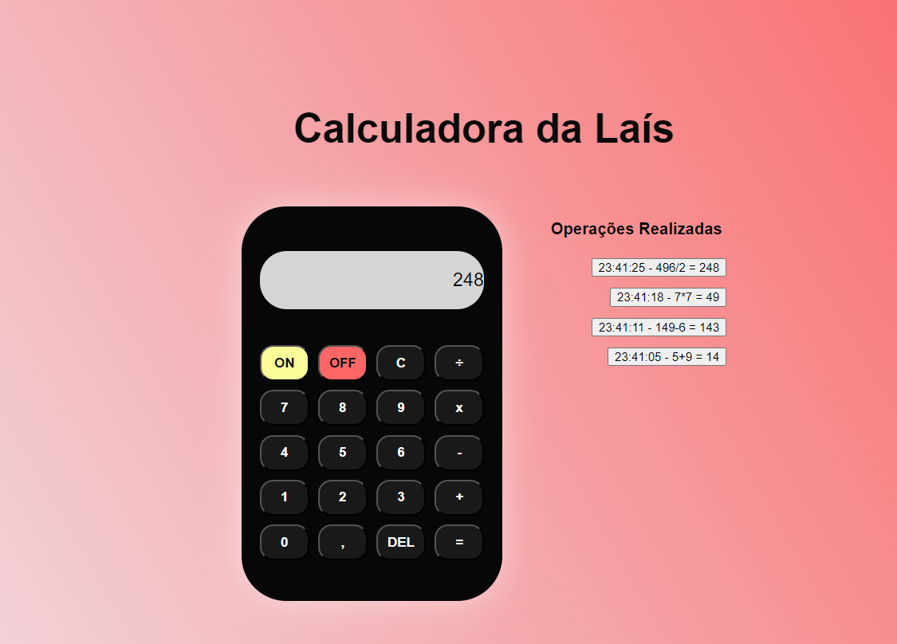

Calculadora da Laís

Bem-vindo ao repositório da Calculadora da Laís! Este é um projeto de uma calculadora funcional desenvolvida utilizando HTML, CSS e JavaScript, com um design moderno e uma interface amigável. A calculadora realiza operações aritméticas básicas e mantém um histórico das últimas operações.

Funcionalidades

Realiza operações básicas: adição, subtração, multiplicação e divisão.

Armazena um histórico das últimas quatro operações realizadas.

Interface moderna com bordas arredondadas e tons de rosa.

Efeito de transição nos botões para uma melhor interatividade.

Verificação de status: os botões só funcionam quando a calculadora está ligada.

Exibe "Erro" em caso de falha de cálculo.

Tecnologias Utilizadas

HTML: Estrutura da calculadora e organização dos elementos na interface.

CSS: Estilização, incluindo fundo gradiente, bordas arredondadas, centralização com Flexbox e responsividade.

JavaScript: Funcionalidade da calculadora, gerenciada pela classe Calculadora, que inclui métodos para:

Ligar e desligar a calculadora.

Ler números e operadores.

Realizar cálculos e exibir resultados.

Apagar o último dígito ou limpar a tela.

Gerenciar o histórico de operações.